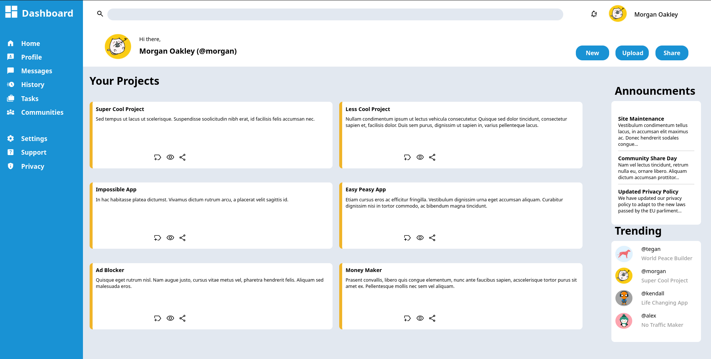
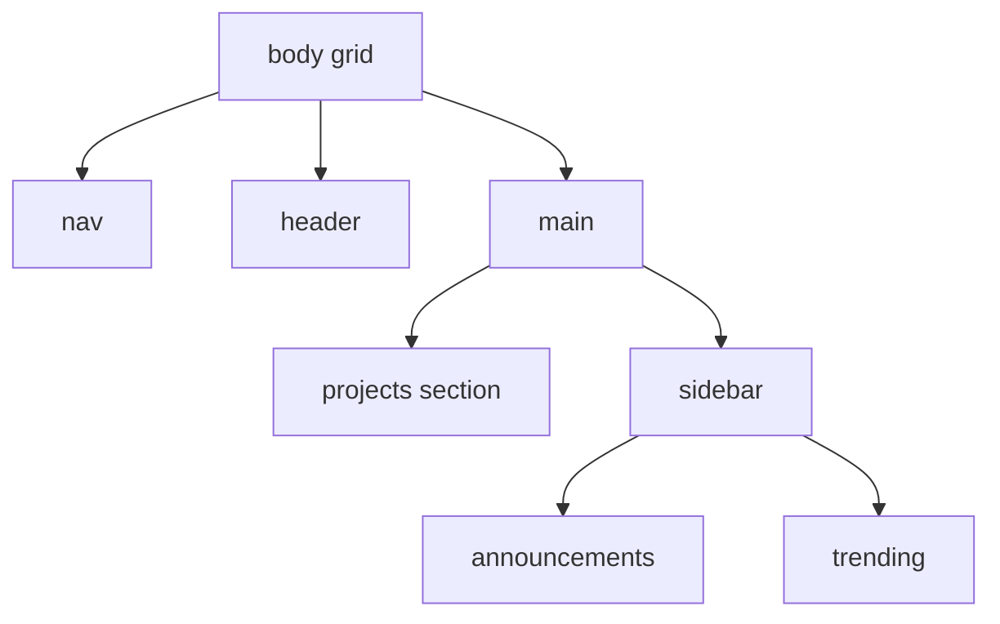
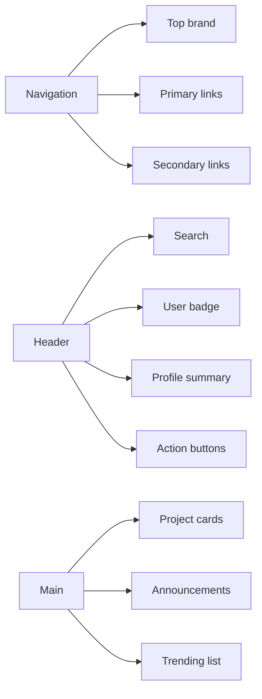

# Admin Dashboard (The Odin Project)

A fully responsive-looking admin dashboard layout built with semantic HTML and modern CSS Grid/Flexbox composition.

This project focuses on translating a reference UI into a clean, maintainable front-end structure while reinforcing layout systems, component thinking, and CSS architecture.

## Live Demo

- Live site: [Admin Dashboard](https://smailoujaoura.github.io/odin_dashboard/)

## Preview



## Project Goals

- Build a multi-region dashboard layout using CSS Grid.
- Combine Grid + Flexbox intentionally (macro layout vs micro alignment).
- Practice reusable UI sections (cards, side panels, nav clusters).
- Improve spacing, visual hierarchy, and dashboard readability.
- Strengthen front-end implementation confidence through a realistic UI.

## Tech Stack

- HTML5 (semantic structure)
- CSS3 (custom properties, Grid, Flexbox, pseudo-elements)
- SVG + PNG assets
- GitHub Pages (deployment)

## Layout Architecture

The dashboard uses a two-column root grid and nested grids/flex containers for internal sections.



## UI Composition Map



## What I Learned

- How to break a complex UI into layout layers: page grid -> section grid -> component alignment.
- How to use CSS custom properties for color consistency and easier theming.
- How to build visual features with pseudo-elements (`::before`) to keep HTML cleaner.
- How to keep repeated component styles consistent across cards, badges, and list items.
- How to improve scanability with spacing, contrast, and consistent typography.

## Challenges and How I Solved Them

- **Challenge:** Balancing Grid and Flexbox without overcomplicating the layout.  
  **Solution:** Used Grid for top-level structure and Flexbox for one-dimensional alignment inside components.

- **Challenge:** Keeping icon/text alignment consistent in nav and card actions.  
  **Solution:** Standardized spacing patterns and repeated utility-like alignment rules.

- **Challenge:** Preserving visual hierarchy across dense dashboard sections.  
  **Solution:** Tuned card sizing, spacing rhythm, and title/body contrast for easier reading.

- **Challenge:** Managing many asset-based icons and avatars.  
  **Solution:** Centralized icon usage through class naming conventions and pseudo-elements.

## Optimizations Implemented

- Reused class naming patterns to reduce styling drift.
- Used CSS variables for predictable color updates.
- Split page into clear structural regions (`nav`, `header`, `main`, `aside`) for maintainability.
- Reused card/action patterns to avoid duplicate design decisions.

## Academic and Professional Value

This project demonstrates strong fundamentals that are directly transferable to production front-end work:

- **Layout engineering:** complex page composition using modern CSS.
- **Component thinking:** repeating UI patterns with consistent behavior and styling.
- **Code organization:** readable class naming and predictable sectioning.
- **UI implementation discipline:** matching a target design while maintaining code clarity.
- **Deployment workflow:** shipping and sharing work through GitHub Pages.

## Recruiter Notes

If you are reviewing this repository, here is what this project highlights:

- Ability to transform design specs into working interfaces.
- Practical understanding of CSS Grid/Flexbox in real UI scenarios.
- Attention to spacing, hierarchy, and user-facing polish.
- Ownership of project delivery from build to deployment.

## Local Setup

1. Clone the repository.
2. Open the project folder.
3. Launch `index.html` in your browser.

No build tools or package installation required.

## Potential Next Improvements

- Improve mobile responsiveness with media queries and breakpoint strategy.
- Add keyboard/focus accessibility enhancements.
- Refactor repeated CSS blocks into utility classes.
- Add dark mode using CSS variables.
- Introduce subtle hover/transition states for better interactivity.

## File Structure

```text
.
├── assets/
├── docs/
│   └── image.png
├── index.html
├── style.css
└── README.md
```

---

Built as part of The Odin Project curriculum to strengthen front-end layout and styling mastery.
